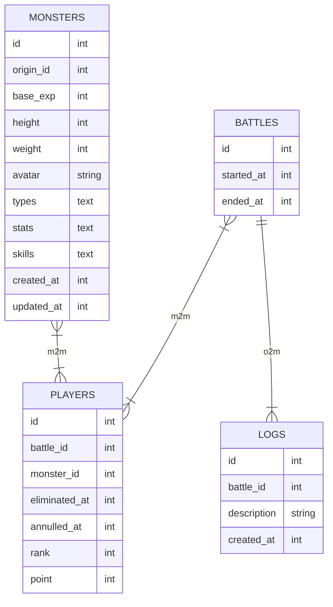

# Pokewar

Pocket Monster Battleroyale

<p align="center">

</p>

---
### NTK - Battleroyale

1. 5 players in 1 battle/round
2. Record battle history
3. Battle ranks & scores 
4. Monsters point based on battle (accumulate rank)
5. Annulled player rank (in the end of battle)

---
#### Basic Entity Info
1. Monsters:
    
   List of Available Monsters (Dex)
   (id, origin_id, name/species, base_exp, height, weight, avatar, types, stats, skills, created_at, updated_at)

2. Battles: 

    Battles Arena with Random/Selected(?) Monster
    (id, started_at, ended_at)

3. Players: 

    List of Played Monsters in 1 Battle 
    (id, battle_id, monster_id, eliminate_at, annulled_at, rank, point)

4. Logs:

    List of Battles Log 
    (id, battle_id, description, created_at)
   
...

#### Entity (*)


#### Sequence (*)
```mermaid
   sequenceDiagram
        participant DELIVERY
        participant SERVICE
        participant SQL_REPOSITORY
        participant REST_REPOSITORY
        par Data Flow
            DELIVERY->>+SERVICE: ...args
        and
            SERVICE->>+REST_REPOSITORY: http call
        and
            SERVICE->>+SQL_REPOSITORY: sql query
        end 
   
     
        REST_REPOSITORY-->>-SERVICE: data
        Note over REST_REPOSITORY,SERVICE: raw data `transformed` from remote data source
   
        SQL_REPOSITORY-->>-SERVICE: data
        Note over SQL_REPOSITORY,SERVICE: raw data from local data source
        
        SERVICE-->>-DELIVERY: data
        Note over SERVICE,DELIVERY: formatted data  
   ```

---
### GTK
Lorem Ipsum is simply dummy text of the printing and typesetting industry. 

#### Required
- Sqlite3
- Golang v1.19

#### Database Migration
###### Required tools:
- [Golang Migrate](https://github.com/golang-migrate/migrate)
###### How to use

- Add new migration
    ```bash
    migrate create -ext sql -dir db/migrations example_table
    ```

- Run Migration
    - up
      ```bash
      go run cmd/cli/main.go migrate up
      ```
    - down
      ```bash
      go run cmd/cli/main.go migrate down
      ```
more info read the [docs](https://pkg.go.dev/github.com/golang-migrate/migrate/v4).

#### Run
Local run: 

`make run`

Build: 

`make build`

Profiling:

`go tool pprof -http=:8001 http://localhost:8000/debug/pprof/profile`

#### Downloads
- [latest]()


