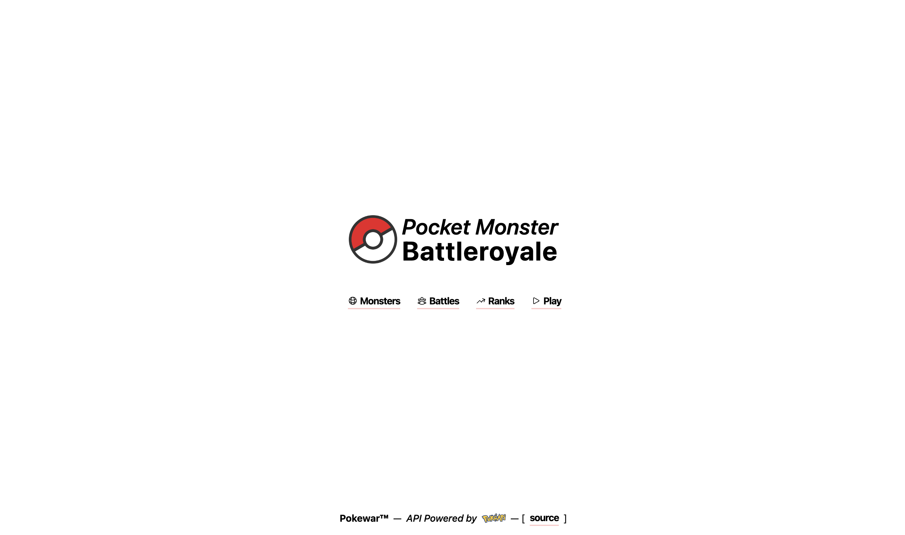

# Pokewar

Pocket Monster Battleroyale



---
### NTK

1. Battleroyale - 5 player in 1 battle
2. Battle History
3. Battle Ranks & Scores (*must dynamic - !(score)declared?)
4. Monsters Point based on Battle (accumulate rank)
5. Annulled Player Rank (end of battle)

---
#### Basic Entity Info
1. Monsters:
    
   List of Available Monsters (Dex)
   (id, name, species, type, skills)

2. Battles: 

    Battles Arena with Random/Selected(?) Monster
    (id, started_at, ended_at)

3. Players: 

    List of Played Monsters in 1 Battle 
    (id, battle_id, monster_id, eliminate_at, annulled_at, rank)

4. Logs:

    List of Battles Log 
    (id, battle_id, name, description)
   

#### Action & Queries 
1. First Booting App:
    
    Validate & sync local monsters list with remote resource (pokeapi)

2. Monster List:

   actions:
        
   - ``
   
   queries:

   - ``

...

#### Entity (*)


#### Sequence (*)
```mermaid
   sequenceDiagram
        participant DELIVERY
        participant SERVICE
        participant REST_REPOSITORY
        participant SQL_REPOSITORY
        par Data Flow
            DELIVERY->>+SERVICE: ...
        and
            SERVICE->>+REST_REPOSITORY: ...
        and
            SERVICE->>+SQL_REPOSITORY: ...
        end 
   
     
        REST_REPOSITORY-->>-SERVICE: ...
        Note over REST_REPOSITORY,SERVICE: ...
   
        SQL_REPOSITORY-->>-SERVICE: ...
        Note over REST_REPOSITORY,SERVICE: ...
        
        SERVICE-->>-DELIVERY: ...
        Note over SERVICE,DELIVERY: ...     
   ```

---
### GTK
Lorem Ipsum is simply dummy text of the printing and typesetting industry. 

#### Req
...

#### Run
...

#### Build
...

#### Deploy
...

#### Downloads
...

---
### PS
- [(*)] mean ...